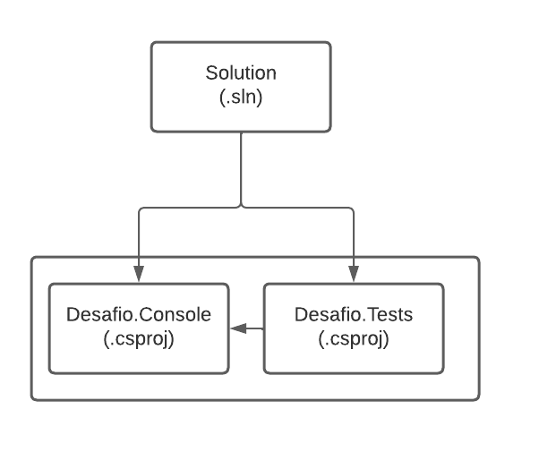

# DIO - Trilha .NET - TDD - Testes Unitários com C#
www.dio.me

## Desafio de projeto
Para este desafio, você precisará usar seus conhecimentos adquiridos no módulo de Blindando Seu Código com TDD e Testes Unitários Usando .NET Core.

## Contexto
O problema informado baseia-se na criação de um conjunto de testes que validarão um sistema de calculadora que possuí as 4 operações básicas (soma, subtração, multiplicação e divisão) e uma funcionalidade de histórico, que retorna os resultados das 3 últimas operações realizadas e uma data informada no construtor do objeto Calculadora.

Por adotar a metologia TDD (Test Driven Development), a primeira etapa foi a criação e montagem dos testes pelos quais os sistema deverá passar, e os retornos esperados.

Em seguida foram desenvolvidos os métodos, garantindo que estes atendessem aos requisitos.

## Premissas
O sistema possui dois projetos: um do tipo console, e um do tipo testes com **xUnit**. O projeto do tipo console possui a classe Calculadora, na qual são realizadas as lógicas principais.

O projeto de testes possui as classes de teste **CalculadoraUnitTest**. 

O objetivo é implementar os métodos de testes contidos no projeto e os métodos da calculadora de forma a atender os requisitos.

## Projeto Console, suas classes e métodos

Essas são as classes do projeto console, onde fica a principal lógica do sistema.

**Classe Calculadora**

Classe responsável por realizar as operações da Calculadora.

| Escopo    | Método                            | Objetivo                                                                              |
|-----------|-----------------------------------|---------------------------------------------------------------------------------------|
| public    | Calculadora (Construtor)          | Recebe a data a ser armazenada no histórico de operações                              |
| private   | InsereHistoricoERetornaResultado  | Realiza a inserção do resultado da operação na lista e retorna o resultado            |
| public    | Somar                             | Realiza a Soma de dois número passados por parâmetro e retorna o resultado            |
| public    | Subtrair                          | Realiza a Subtração de dois número passados por parâmetro e retorna o resultado       |
| public    | Multiplicar                       | Realiza a Multiplicação de dois número passados por parâmetro e retorna o resultado   |
| public    | Dividir                           | Realiza a Divisão de dois número passados por parâmetro e retorna o resultado         |
| public    | Historico                         | Retorna uma lista de strings com os 3 últimos resultados e a data informada           |

## Projeto do tipo teste, suas classes e métodos

**Classe CalculadoraUnitTest**

Classe responsável por realizar os testes da classe Calculadora.

| Método de teste            | Resultado esperado do teste                                                                             |
|----------------------------|---------------------------------------------------------------------------------------------------------|
| TesteSomar                 | Ao passar dois números inteiros, deve retornar a soma entre esses valores                               |
| TesteSubtrair              | Ao passar dois números inteiros, deve retornar a subtração entre esses valores                          |
| TesteMultiplicar           | Ao passar dois números inteiros, deve retornar a multiplicação entre esses valores                      |
| TesteDividir               | Ao passar dois números inteiros, deve retornar a divisão entre esses valores                            |
| TesteDivisaoPorZero        | Ao passar um número inteiro qualquer e 0, deve lançar a exceção DivideByZeroException                   |
| TestarHistoricoPreenchido  | Ao solicitar um histórico após 4 operações, deve retornar uma lista de strings com as 3 últimas         |
| TestarHistoricoIncompleto  | Ao solicitar um histórico após 1 operação, deve retornar uma lista de string com o resultado da última  |

## Estrutura do projeto

O projeto está estruturado da seguinte maneira:

## Solução
O código foi implementado conforme orientado, desenvolvendo os métodos de teste e, em seguida, os métodos implementados na classe calculadora que atendessem aos critérios de aceite propostos.
